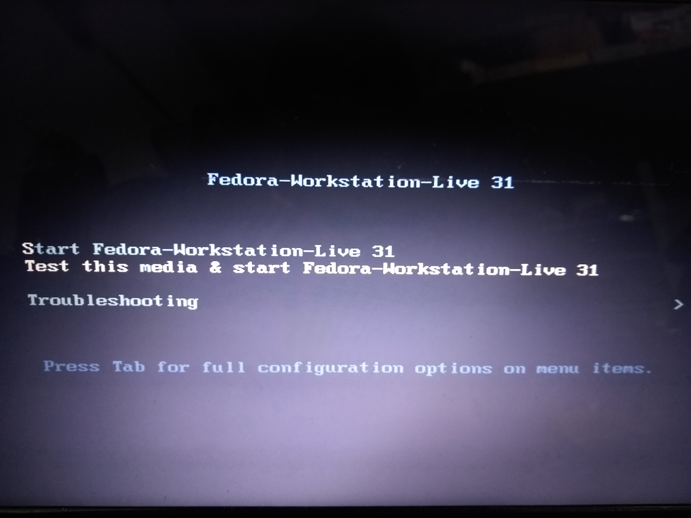
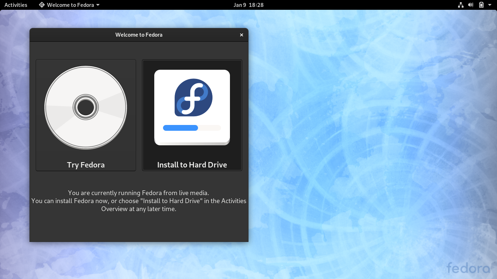
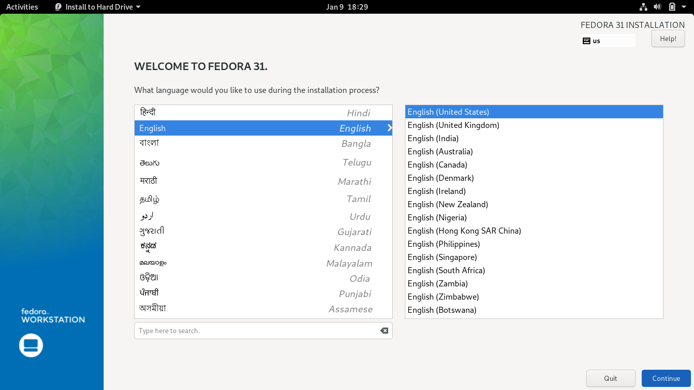
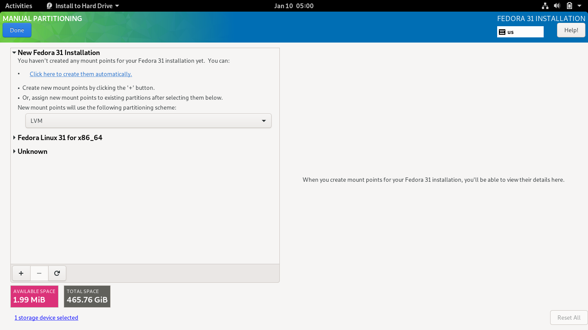
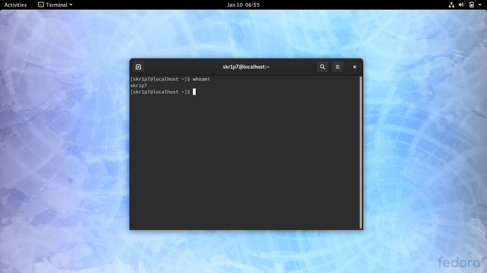

# How to install Fedora Workstation 101

## Table of Contents:

* Downloading
* Burning the ISO
* Installation

### Downloading

First of all to start off with anything, let's download our Fedora Workstation ISO file from [here](https://download.fedoraproject.org/pub/fedora/linux/releases/31/Workstation/x86_64/iso/Fedora-Workstation-Live-x86_64-31-1.9.iso). This is a direct link to grab your copy of Fedora Workstation ISO File.
Or you can navigate to the [download](https://getfedora.org/en/workstation/download/) page and download from there manually in case the above link fails. Here is how the download page of the Fedora Workstation looks:

### Burning the ISO 

After following the steps above, let's now create our bootable USB a.k.a Live USB. Expecting that you are a Windows user beforehand, we will use a software called **Rufus**, here is a direct [link](https://github.com/pbatard/rufus/releases/download/v3.8/rufus-3.8.exe) to download the *exe* file and install it. 
After the installtion is over, let's run Rufus. 

This is what the wizard looks like:

Up next we will plug in a USB Drive and as soon as you plug in the USB Drive, the wizard will look something similar to this:

You must have noticed the **CD** icon in the wizard, that option helps us open the file explorer and select the ISO image. Once you click on the **CD** icon, look for your ISO file and select then hit **Enter** or click on **Open** button.
The  file explorer looks like this:

Click on the **Start** button and the software will as you if you want to use **ISO** mode or **DD** mode. Confusing right?
Let me explain, if you select **ISO** mode, the installation files will occupy the space of the USB disk that it needs and rest will be available for you to use, whereas if you select **DD** mode, the installation files will occupy the space (usually around 6-7 GB) and rest of the space will not be abailable for you to make use of. 

The wizard look something like this:

I prefer you to select **ISO** mode, select **ISO** mode and click on the **OK** button. 

Soon you'll get to see that the data is being written to the USB Drive and the prompt will look like the image attached below:

It usually takes anything between 5-10 minutes (which totally depends on your machine and the USB Media) to burn the ISO, after the burning is complete, the wizard will look like this:

Click on **Close** button and restart your machine in order to (*Live*) boot into Fedora Workstation. 

### Installation

The first look is something like this:

Use the arrow keys to navigate to *Start Fedora-Workstation-Live 31* and hit **Enter** 

Following next will be a *Kernel Panic* about which you don't need to panic. It must look like this:

Let it go and wait until you see the **Welcome to Fedora** screen.

Select the **Install to Hard Drive** option. After which you'll see a language selection wizard like this:

Let's continue with *English* and hit **Continue** button. This step will prompt us with an **Installtion Summary** wizard that look like this:

Click on the Hard Drive icon that is labelled as **INSTALLATION DESTINATION** and hit **Begin Installation** button to get to the next wizard.

On the **INSTALLATION DESTINATION** screen, click on your Hard Drive, click the **Radio Button** that says **Custom** which will guide you to the **MANUAL PARTITIONING** screen. The screenshot attached below shows how the wizard looks like:

Under the **New Fedora 31 Installation** drop down menu, click on *Click here to create them automatically.* 
This will choose the largest free space from your disk and create 6 partitons that are as follows:

1. **/boot**
2. **/home**
3. **/swap**
4. **/** (root)
5. **/tmp**
6. **/usr**

Click on the *Done* button and follow the steps as prompted in the Wizard which is usually just to ask for the confirmation of formatting the partitions or creating the partitions. After the installation is over, you are supposed to restart the machine and this is what a fresh installtion looks like:

# Thanks!  